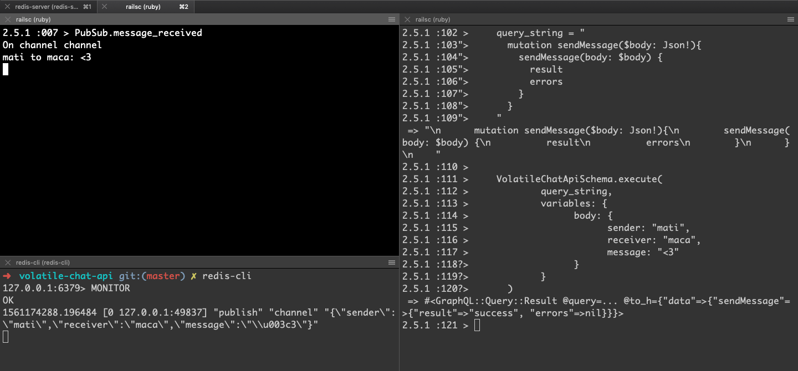

# Volatile chat API

    rvm gemset create volatile-chat-api
    rvm gemset use volatile-chat-api

## Subscribe to receive the chat messages

Open up a Rails console tab (`rails c`), the copy and paste the following code snippet. 

    require './app/lib/pub_sub'
    
    PubSub::Subscriber.message_received

The previous code sets up a deamon that returns received messages every time a messages is sent through the GraphQL endpoint.  

## Send a message through the chat

Open up a new Rails console tab and copy-paste both the string and method shown below.

    query_string = "
      mutation sendMessage($body: Json!){
        sendMessage(body: $body) {
          result
          errors
        }
      }
    "

    VolatileChatApiSchema.execute(
        query_string,
        variables: {
            body: {
                sender: "mati",
                receiver: "maca",
                message: "<3"
            }
        }
    )

## What is happening here?

We set up a process that is continuously checking incoming messages to Redis. In the image below we can see that the message is sent using directly the GraphQL Schema (right half of the picture), then the image is stored/published in Redis (bottom of the left half of the picture) and then the subscribe process detects that a message was published, and prints out the message.

# Todo

1. The subscribed method still needs to be tuned!
2. This project is just an API. The frontend part of it still needs to be implemented.

## Resources

- [Gemfile](https://bundler.io/man/gemfile.5.html)
- [Pub/Sub](https://redis.io/topics/pubsub)
- [Redis Pub/Sub](https://thoughtbot.com/blog/redis-pub-sub-how-does-it-work)
- [GraphQL Ruby](https://graphql-ruby.org/)
- [Rspec Rails](https://github.com/rspec/rspec-rails)
- [Testing GraphQL Mutations In Ruby On Rails With RSpec](https://selleo.com/blog/testing-graphql-mutations-in-ruby-on-rails-with-rspec)
- [Using Factory Bot without ORM](https://thoughtbot.com/blog/tips-for-using-factory-girl-without-an-orm)
